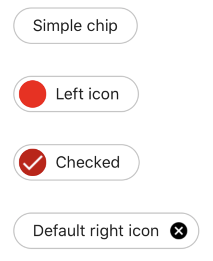

# React native material chip


React Native component for Anroid and iOS inspired by [Material Design Chip](https://material.io/components/chips)

## Installing

Install `react-native-material-chip`:

```shell script
yarn add react-native-material-chip
or
npm install react-native-material-chip
```

## Usage



```jsx
import React from 'react'
import MaterialChip from "react-native-material-chip"

const BasicExample = () => {
    return (
        <MaterialChip
            text="Example"
            checked={true}
            onPress={() => console.log('press')}
            onDelete={() => console.log('delete')}
            textStyle={{color: 'rgba(0, 0, 0, 0.87)'}}
            leftIcon={
                <View
                    style={{
                        height: MaterialChip.CHIP_LEFT_ICON_SIZE,
                        width: MaterialChip.CHIP_LEFT_ICON_SIZE,
                        borderRadius: MaterialChip.CHIP_RADIUS,
                        backgroundColor: 'rgba(252,0,0,1)',
                        borderWidth: 0
                    }}
                />
            }
            rightIcon={
                <View
                    style={{
                        height: MaterialChip.CHIP_RIGHT_ICON_SIZE,
                        width: MaterialChip.CHIP_RIGHT_ICON_SIZE,
                        borderRadius: MaterialChip.CHIP_RIGHT_ICON_RADIUS,
                        backgroundColor: 'rgba(252,0,0,1)',
                        borderWidth: 0
                    }}
                />
            }
        />    
    )
}

export default BasicExample
```

## `<MaterialChip />` component api

### Props

The component extents the [ViewProperties](https://reactnative.dev/docs/view-style-props)

| Prop | Type | Default |
| ---- | ---- | ------- |
| `text` | `string` |  |
| `checked` | `boolean` | `false` |
| `onPress` | `function` | `null` |
| `leftIcon` | `element` | `null` |
| `rightIcon` | `element` | `null` |
| `onDelete` | `function` | `null` |
| `textStyle` | `object` | `null` |

### Constants

| Prop | Type | Value |
| ---- | ---- | ------- |
| `CHIP_HEIGHT` | `number` | `32dp` |
| `CHIP_RADIUS` | `number` | `16dp` |
| `CHIP_MARGIN` | `number` | `14dp` |
| `CHIP_TEXT_SIZE` | `number` | `14dp` |
| `CHIP_TEXT_MARGIN` | `number` | `16dp` |
| `CHIP_LEFT_ICON_SIZE` | `number` | `24dp` |
| `CHIP_LEFT_ICON_RADIUS` | `number` | `12dp` |

